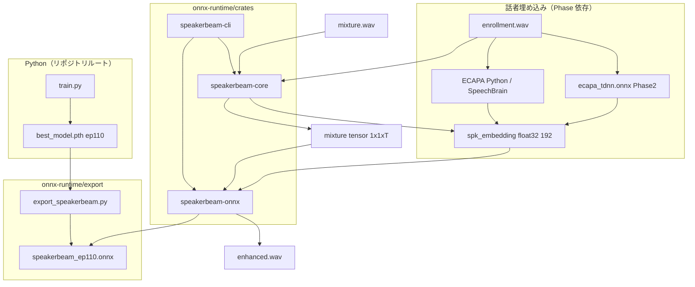

# OpenSpeakerBeam-SS ONNX Runtime — 詳細設計

## 1. 目的とスコープ

### 1.1 目的

- PyTorch 学習済み **SpeakerBeamSS（ep110）** を ONNX 経由で **Rust + ONNX Runtime** 上で推論する。
- Python `inference.py` と **聴感・数値が一致** する推論パスを提供する（post-filter は段階的に移植）。
- フォルダ `onnx-runtime/` を推論専用ツリーとし、学習コードと明確に分離する。

### 1.2 スコープ外（初期フェーズ）

- 学習・fine-tune（リポジトリルートの Python のみ）
- GPU / CUDA EP（初期は **CPU EP** のみ）

### 1.3 ストリーミング（任意長入力）

**10 秒固定は採用しない。** ストリーミング入力は Python `model/streaming.py` の
`SpeakerBeamSSStream` で処理する（`inference.py --stream`）。

| 項目 | 内容 |
|---|---|
| エンコーダ | 320 sample 窓・160 stride で 1 latent frame ずつ追加 |
| セパレータ | 蓄積 latent に cgLN（推論時 gLN→cgLN 差し替え） |
| デコーダ | 1 latent frame ルックアヘッド後に出力（約 10 ms 遅延） |
| オフライン比 | cgLN ストリーム vs cgLN バッチ: max diff ≈ 1e-7 |
| 学習時 gLN 比 | max diff ≈ 0.26（聴感トレードオフ、仕様として文書化） |

単一 ONNX（動的長 S4D conv）は **エクスポート不可**（カーネル長がシンボリック）。
Rust 側は Encoder / Decoder ONNX + S4D 状態ネイティブ実装（Phase 2）を予定。

---

## 2. リポジトリ階層

```
OpenSpeakerBeam-SS/                          # Python: 学習・研究・データ生成
├── train.py
├── inference.py
├── model/                                   # PyTorch モデル定義
├── tools/                                   # ECAPA-TDNN ラッパー
├── checkpoints/scratch_v2_lowsir/           # ep110 本番重み (.pth)
│
└── onnx-runtime/                            # ★ Rust ONNX 推論（本ドキュメントの対象）
    ├── DESIGN.md
    ├── README.md
    ├── Cargo.toml                           # workspace
    │
    ├── crates/
    │   ├── speakerbeam-core/                # 共有ライブラリ
    │   │   └── src/
    │   │       ├── lib.rs
    │   │       ├── audio.rs                 # WAV 読込・16kHz mono・正規化
    │   │       ├── embedding.rs             # マルチセグメント平均（Python 同等）
    │   │       └── config.rs                # 定数（SR=16000, emb=192, ...）
    │   │
    │   ├── speakerbeam-onnx/                # ONNX Runtime ラッパー
    │   │   └── src/
    │   │       ├── lib.rs
    │   │       ├── session.rs               # Session 構築・推論実行
    │   │       ├── tensor.rs                # ndarray ↔ Ort Value
    │   │       └── parity.rs                # Python 出力との誤差検証（dev）
    │   │
    │   └── speakerbeam-cli/                 # 実行バイナリ
    │       └── src/
    │           └── main.rs                  # CLI: mixture + enrollment → wav
    │
    ├── export/                              # PyTorch → ONNX（Python）
    │   ├── README.md
    │   ├── export_speakerbeam.py              # SpeakerBeamSS エクスポート
    │   └── verify_onnx.py                   # ONNX vs PyTorch 誤差チェック
    │
    ├── models/                              # 配置先（*.onnx は .gitignore 推奨）
    │   └── .gitkeep
    │
    └── tests/
        ├── README.md
        ├── parity/                            # 数値一致テスト手順
        └── fixtures/                          # 短い wav 参照（シンボリックリンク可）
```

**命名規則**

| プレフィックス | 意味 |
|---|---|
| `onnx-runtime/` | Rust 推論ツリー全体 |
| `speakerbeam-*` | Rust クレート名（ライブラリ責務が名前から分かる） |
| `export/` | ONNX 生成は Rust ではなく Python（学習モデルと同居） |

---

## 3. システムアーキテクチャ

### 3.1 全体データフロー



### 3.2 処理パイプライン（推論1回）

| Step | 処理 | 実装場所 | Phase |
|------|------|----------|-------|
| 0 | WAV 読込・16 kHz mono | `speakerbeam-core::audio` | 1 |
| 1 | enrollment マルチセグメント ECAPA → 平均 192-d | `embedding`（Python 呼出 or ONNX） | 1 / 2 |
| 2 | L2 正規化（cosine 用、推論フィルタと整合） | `embedding` | 1 |
| 3 | mixture → `float32 [1,1,T]` | `speakerbeam-onnx` | 1 |
| 4 | **SpeakerBeamSS ONNX 推論** | `session.rs` | 1 |
| 5 | 出力 WAV 保存 | `speakerbeam-cli` | 1 |
| 6 | SV フィルタ / refine（任意） | `postprocess` モジュール | 3 |

---

## 4. ONNX モデル契約（SpeakerBeamSS）

### 4.1 エクスポート対象

PyTorch `SpeakerBeamSS.forward(mixture, spk_embedding)` のみを ONNX 化する。

- **含む:** Encoder → Separator（FiLM + S4D×6）→ Decoder
- **含まない:** ECAPA-TDNN（別モデル）、VAD（Silero）、post-filter

エクスポート用ラッパー（`export/export_speakerbeam.py`）:

```python
class SpeakerBeamOnnxWrapper(nn.Module):
    def forward(self, mixture: Tensor, spk_embedding: Tensor) -> Tensor:
        # mixture: (1, 1, T), spk_embedding: (1, 192)
        return self.model(mixture, spk_embedding)
```

### 4.2 テンソル仕様

| 名前 | dtype | shape | 説明 |
|------|-------|-------|------|
| `mixture` | float32 | `[1, 1, T]` | 混合音声。`T` は動的軸 |
| `spk_embedding` | float32 | `[1, 192]` | ECAPA 出力（バッチ平均後） |
| `enhanced` | float32 | `[1, 1, T_out]` | 分離音声。`T_out ≈ T` |

### 4.3 時間軸の長さ

Encoder: `Conv1d(kernel=320, stride=160, padding=0)`

```
T_enc = floor((T - 320) / 160) + 1   (T >= 320)
```

Decoder: `ConvTranspose1d(kernel=320, stride=160)` で元長に復元。

**オフライン一括推論用:** `T=16000*10` でトレース検証可能（固定長 ONNX）。
**ストリーミング:** 上記単一グラフは使わず、`SpeakerBeamSSStream`（Python）または
分割 ONNX + 状態 I/O（Rust Phase 2）を使用する。

### 4.4 数値一致基準（parity）

| 指標 | 許容 |
|------|------|
| max abs diff vs PyTorch | < 1e-4（CPU float32） |
| SI-SNR 差 | < 0.1 dB |

検証: `export/verify_onnx.py` と `tests/parity/`

---

## 5. Rust クレート設計

### 5.1 ワークスペース `Cargo.toml`

```toml
[workspace]
members = [
    "crates/speakerbeam-core",
    "crates/speakerbeam-onnx",
    "crates/speakerbeam-cli",
]
resolver = "2"
```

### 5.2 `speakerbeam-core`

**責務:** フレームワーク非依存のドメインロジック。

```rust
// 公開 API（案）
pub struct AudioConfig {
    pub sample_rate: u32,      // 16000
    pub embed_dim: usize,      // 192
    pub enroll_segment_sec: f32, // 5.0
    pub enroll_max_segments: usize, // 4
}

pub fn load_wav_mono_16k(path: &Path) -> Result<Vec<f32>, Error>;
pub fn multi_segment_embedding(/* ... */) -> Result<Vec<f32>, Error>; // Phase1: pyo3/外部プロセス
```

**依存（案）:** `hound`（WAV）, `thiserror`, `ndarray`

### 5.3 `speakerbeam-onnx`

**責務:** ONNX Runtime Session のライフサイクルと推論。

```rust
pub struct SpeakerBeamSession {
    session: ort::Session,
    input_names: InputNames,
}

impl SpeakerBeamSession {
    pub fn from_file(model_path: &Path, threads: usize) -> Result<Self, Error>;
    pub fn run(&self, mixture: &[f32], embedding: &[f32; 192]) -> Result<Vec<f32>, Error>;
}
```

**依存（案）:** `ort`（onnxruntime-rs）, `ndarray`, `speakerbeam-core`

**SessionOptions:**

- EP: `CPUExecutionProvider`
- `intra_op_num_threads`: 物理コア数
- graph optimization: `Level::All`

### 5.4 `speakerbeam-cli`

**責務:** エンドユーザー向け CLI。

```
speakerbeam-cli
  --mixture   <path>
  --enrollment <path>
  --output    <path>
  --model     <speakerbeam.onnx>   [default: models/speakerbeam_ep110.onnx]
  --embedding-backend python|onnx   [default: python]
  --ecapa-model <path>              [Phase2]
  --threads   <n>
```

---

## 6. 話者埋め込み（ECAPA）の段階的扱い

| Phase | 方式 | メリット |
|-------|------|----------|
| **1** | Python `tools.load_ecapa_model` をサブプロセス / 事前計算 JSON で渡す | 実装が最速。SpeakerBeam ONNX 検証に集中できる |
| **2** | `ecapa_tdnn.onnx` を Rust から実行 | 完全 Rust 推論パス |
| **3** | Silero VAD を Rust 化し Python `inference.py` と同等の前処理 | 埋め込み品質一致 |

Phase 1 では CLI が `--embedding-npy enrollment.npy` を受け取れるようにしてもよい（デバッグ用）。

---

## 7. Post-processing 移植計画（Python `inference.py` 対応）

| Python 関数 | 本番使用 | Rust 移植優先度 |
|-------------|----------|-----------------|
| `--no_filter` | **ep110 本番** | —（ ONNX 生出力のみ） |
| `speaker_verification_filter` | オプション | Phase 3（ECAPA frame scores 必要） |
| `refine_output_filter` | オプション | Phase 3 |
| `reject_enrollment` | オプション | Phase 3 |

本番 ep110 は **`--no_filter`** のため、Phase 1 の Rust MVP は post-process なしで十分。

---

## 8. 実装フェーズ

### Phase 1 — MVP（SpeakerBeam ONNX + Rust CLI）✅ 実装済み

| 項目 | 状態 |
|------|------|
| `export/export_speakerbeam.py` | ✅ S4D を conv1d + 凍結カーネルで ONNX 化 |
| `verify_onnx.py` | ✅ max diff ≈ 1.8e-4 |
| `verify_real_audio.py` | ✅ 実音声 max diff ≈ 3.5e-5、RMS 一致 |
| `extract_embedding.py` | ✅ `.npy` 出力 |
| `speakerbeam-onnx` | ✅ `ort` Session ラッパー |
| `speakerbeam-cli` | ✅ `--embedding-npy` / `--enrollment` |

**制約:** ONNX は **固定 10s（160000 samples）** でトレース。動的長は Phase 2。

**S4D 対策:** `export/onnx_utils.py` がエクスポート時のみ FFT/複素数パスを回避。

### Phase 2 — ECAPA ONNX + ストリーミング分割 ONNX ✅ 実装済み

| 項目 | 状態 |
|------|------|
| `export/export_ecapa.py` | ✅ `ecapa_embedding.onnx` + `ecapa_fbank.npz` |
| `export/compute_ecapa_features.py` | ✅ SpeechBrain FBank（Python） |
| `export/export_streaming_models.py` | ✅ encoder_frame / decoder / separator_cgln |
| `speakerbeam-onnx::EcapaSession` | ✅ features → 192-d |
| `speakerbeam-onnx::StreamingSession` | ✅ 任意長ストリーミング |
| `speakerbeam-cli --embedding-backend onnx` | ✅ FBank Python + embed ONNX |
| `speakerbeam-cli --stream` | ✅ 分割 ONNX ストリーミング |

**ECAPA 制約:** 波形全体の ONNX 化は STFT/complex で不可。Phase 2 は
`compute_ecapa_features.py`（FBank）+ `ecapa_embedding.onnx`（TDNN）のハイブリッド。

**ストリーミング制約:** separator は固定長 Lpad（デフォルト 2048 latent frame）に
ゼロパッド。cgLN のため短い系列でも数値安全。

### Opus ストリーミング入力（60 ms チャンク）

デコーダ出力は Opus 復号後 **16 kHz PCM** を想定する。

| 項目 | 値 |
|---|---|
| 入力チャンク | 60 ms → **960 samples** |
| 処理単位 | **2〜3 チャンク毎**（推奨） |
| 2 チャンク | 120 ms → **1920 samples** / 推論 |
| 3 チャンク | 180 ms → **2880 samples** / 推論 |
| 追加遅延 | decoder ルックアヘッド **1 frame ≈ 10 ms** |

```
Opus decode → PCM 60ms ──┐
                         ├─×2 or ×3─→ SpeakerBeam push() → 分離 PCM
Opus decode → PCM 60ms ──┘
```

CLI / Python:

```text
--input-chunk-ms 60 --process-every-chunks 2   # 120 ms
--input-chunk-ms 60 --process-every-chunks 3   # 180 ms
```

**レイテンシ注意:** Phase 2 の `separator_cgln.onnx`（L=2048 固定）は 1 回 **~535 ms**（CPU 実測）。
60 ms×2〜3 チャンクの集約だけではリアルタイムにならない。

**増分 Rust（Phase 2.5）:** `IncrementalStreamingSession` = encoder/decoder ONNX +
`streaming_separator.npz` 上のネイティブ SeparatorStream（増分 S4D 状態）。
CLI `--stream` デフォルト。遅い全履歴 ONNX は `--stream-full-separator`。

| ONNX 部品 | L=16 CPU 実測 |
|---|---|
| encoder_frame ×12 | ~0.4 ms |
| separator_chunk | ~3 ms |
| decoder L≈1000 | ~4 ms |

export:

```bash
python onnx-runtime/export/export_streaming_models.py
python onnx-runtime/export/export_streaming_weights.py
cargo run -p speakerbeam-cli --release -- --stream \
  --input-chunk-ms 60 --process-every-chunks 2 ...
```

### Phase 3 — Post-filter & 完全 Rust ECAPA

1. SV フィルタの frame-wise cosine（Rust）
2. SpeechBrain 互換 FBank の Rust 実装（VAD 含む）

---

## 9. ビルド・CI

```yaml
# 将来の CI 案
onnx-runtime:
  - pip install onnx onnxruntime torch (export only)
  - python export/export_speakerbeam.py
  - cargo test -p speakerbeam-onnx
  - cargo build --release -p speakerbeam-cli
```

`.gitignore` 追加対象:

- `onnx-runtime/target/`
- `onnx-runtime/models/*.onnx`（大容量）

---

## 10. リスクと対策

| リスク | 対策 |
|--------|------|
| S4D 内 FFT が ONNX で unsupported / 精度低下 | opset 17、`verify_onnx.py` で全長 10s 検証。ダメなら FFT 部分をカスタム op または近似 |
| 動的長 `T` の ORT バグ | 固定長 160000（10s）と動的長の両方でテスト |
| ECAPA の Python 依存が重い | Phase 1 は npy 事前計算で切り離す |
| LayerNorm / GLU の ONNX 変換差 | max diff 閾値で自動 fail |

---

## 11. 参照（リポジトリ内）

| ファイル | 内容 |
|----------|------|
| `../model/__init__.py` | `SpeakerBeamSS`, Encoder/Separator/Decoder |
| `../inference.py` | 推論パイプライン本番仕様（ep110, nofilt） |
| `../tools/__init__.py` | ECAPA 192-dim, VAD, 5秒クロップ |
| `../checkpoints/scratch_v2_lowsir/best_model.pth` | ep110 重み |
